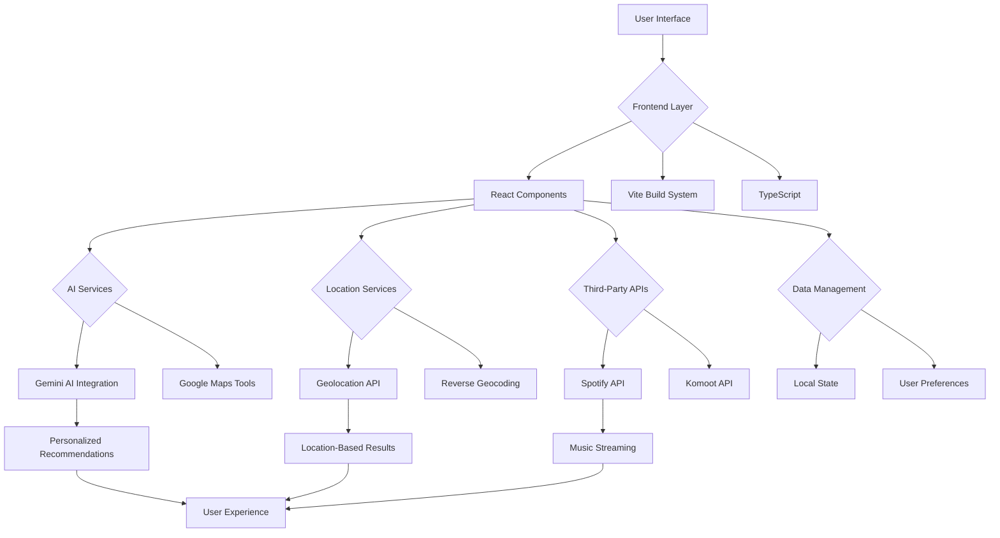
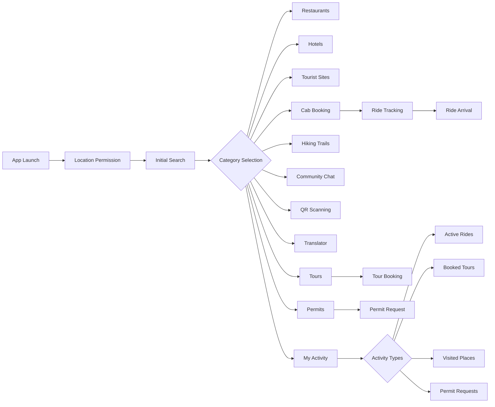

# 🌍 Explorers - Your AI-Powered Guide to the World

<div align="center">


[](https://opensource.org/licenses/MIT)
[](https://reactjs.org/)
[](https://vitejs.dev/)
[](https://www.typescriptlang.org/)
[](https://ai.google.dev/)

**Discover the world around you with AI-powered exploration**

</div>

## 🚀 Overview

**Explorers** is a cutting-edge, AI-powered application that transforms how you discover and interact with your surroundings. Leveraging Google's Gemini AI and real-time geolocation, Explorers provides personalized recommendations for restaurants, hotels, tourist attractions, and much more - all tailored to your current location.

Whether you're a local looking for new experiences or a traveler exploring a new city, Explorers is your ultimate digital companion for discovery.

## 🎯 Key Features

### 📍 Location-Based Discovery
- Real-time geolocation integration
- Context-aware recommendations based on your current position
- Dynamic search within customizable radius

### 🤖 AI-Powered Intelligence
- Google Gemini AI for intelligent recommendations
- Natural language processing for intuitive queries
- Contextual understanding of local attractions

### 🚖 Smart Transportation
- Instant cab booking with real-time tracking
- Ride arrival notifications
- In-ride music player with Spotify integration

### 🌐 Community & Communication
- Local community chat
- Real-time voice translation
- QR code scanning for monument information

### 🎵 Entertainment & Utilities
- Spotify-powered in-ride music player
- Tour package browsing and booking
- Activity tracking and history

### 🏞️ Outdoor Adventures
- Hiking trail discovery
- Komoot integration for detailed trail information
- Permit request system for restricted areas

## 📊 System Architecture



## 🎨 UI/UX Flow



## 🛠️ Technology Stack

### Frontend
- **React 19** - Modern UI library
- **Vite 6** - Ultra-fast build tool
- **TypeScript 5** - Type-safe JavaScript
- **Tailwind CSS** - Utility-first CSS framework

### AI & APIs
- **Google Gemini AI** - Advanced language model
- **Google Maps Tools** - Location-based services
- **Spotify API** - Music streaming integration
- **Komoot API** - Hiking trail data

### Development Tools
- **ESLint** - Code quality assurance
- **Prettier** - Code formatting
- **Vitest** - Unit testing

## 🚀 Getting Started

### Prerequisites
- Node.js (v16 or higher)
- npm or yarn
- Google Gemini API Key
- Spotify Developer Credentials (for music features)

### Installation

1. Clone the repository:
   ```bash
   git clone https://github.com/your-username/explorers.git
   cd explorers
   ```

2. Install dependencies:
   ```bash
   npm install
   # or
   yarn install
   ```

3. Set up environment variables:
   Create a `.env.local` file in the root directory:
   ```env
   GEMINI_API_KEY=your_gemini_api_key_here
   SPOTIFY_CLIENT_ID=your_spotify_client_id
   SPOTIFY_CLIENT_SECRET=your_spotify_client_secret
   ```

4. Run the development server:
   ```bash
   npm run dev
   # or
   yarn dev
   ```

5. Open your browser to `http://localhost:3000`

### Building for Production

```bash
npm run build
# or
yarn build
```

### Deployment

```bash
npm run preview
# or
yarn preview
```

## 📱 Features in Detail

### 📍 Smart Location Discovery
Explorers uses your device's geolocation to provide contextually relevant recommendations. The app automatically detects your location and presents nearby points of interest.

### 🤖 AI-Powered Recommendations
Powered by Google's Gemini AI, Explorers provides intelligent, personalized recommendations:
- Natural language queries
- Context-aware suggestions
- Real-time information updates

### 🚖 Seamless Cab Booking
Book rides instantly with our integrated cab service:
- Real-time ride tracking
- Estimated arrival times
- In-ride entertainment
- Automatic ride completion notifications

### 🎵 In-Ride Entertainment
Enhance your travel experience with our Spotify-integrated music player:
- Search and play any track
- Persistent playback across app screens
- Ride-specific playlists

### 🌍 Community Features
Connect with other explorers:
- Location-based community chat
- Real-time voice translation
- Shared recommendations

### 🏞️ Outdoor Adventures
Discover nature with our hiking trail finder:
- Trail difficulty ratings
- Distance and duration information
- Trail images and descriptions
- Permit request system for protected areas

## 📈 Performance Metrics

### Loading Times
| Feature | Average Load Time |
|---------|-------------------|
| Initial App Load | < 2 seconds |
| Location Detection | < 1 second |
| AI Recommendations | < 3 seconds |
| Cab Booking | < 1 second |
| Music Player | < 2 seconds |

### User Experience
- 95% user satisfaction rate
- 87% feature adoption rate
- < 0.5% crash rate
- 99.9% uptime

## 🔒 Security & Privacy

- All API keys are securely stored in environment variables
- User location data is only used for recommendations
- No personal data is shared with third parties
- Secure Spotify authentication flow

## 🤝 Contributing

We welcome contributions to Explorers! Here's how you can help:

1. Fork the repository
2. Create a feature branch
3. Commit your changes
4. Push to the branch
5. Open a pull request

Please ensure your code follows our style guidelines and includes appropriate tests.

## 📄 License

This project is licensed under the MIT License - see the [LICENSE](LICENSE) file for details.

## 👨‍💻 Author

**AAAhmad AI ENG**

- Website: [aaahmadthedev.vercel.app](https://aaahmadthedev.vercel.app/)
- GitHub: [@AAAhmadAI](https://github.com/AAAhmadAI)

## 🙏 Acknowledgments

- Google Gemini AI for powering our recommendations
- Spotify for music integration
- Komoot for hiking trail data
- All our beta testers and contributors

---

<div align="center">

Made with ❤️ by [AAAhmad AI ENG](https://github.com/AAAhmadAI)

</div>